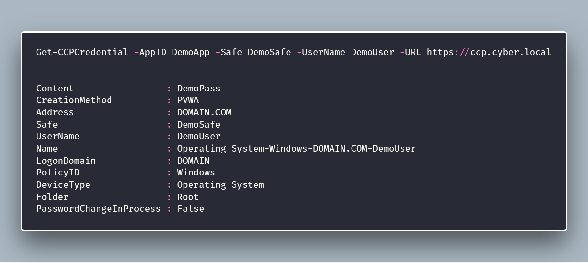
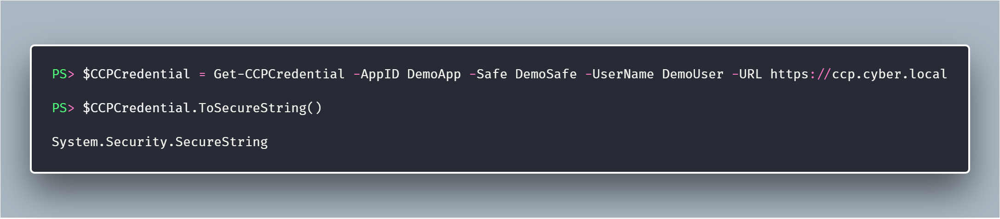
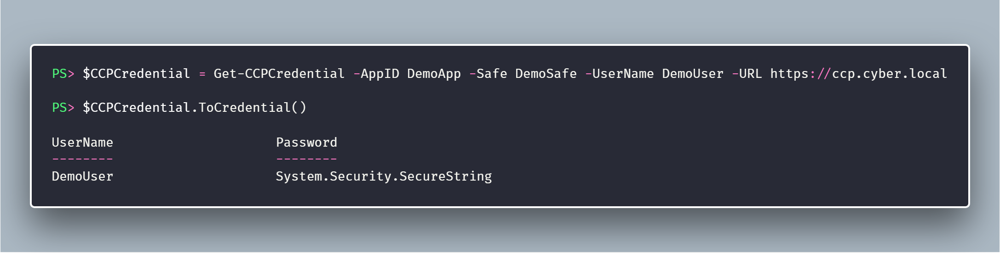

# CredentialRetriever

[](https://ci.appveyor.com/project/pspete/CredentialRetriever/branch/master)
[](https://ci.appveyor.com/project/pspete/CredentialRetriever)
[](https://coveralls.io/github/pspete/CredentialRetriever)
[](https://www.powershellgallery.com/packages/CredentialRetriever)
[](https://github.com/pspete/CredentialRetriever/blob/master/LICENSE)

## **CyberArk Central Credential Provider PowerShell Retriever**

Use PowerShell to retrieve credentials from the CyberArk Central Credential Provider Web Service.

----------

## Usage

### Get-CCPCredential

Supply the AppID and URL to the CyberArk Central Credential Provider Web Service.

Specify relevant parameter values needed to find the required account.



### ToSecureString Method

Where required for downstream consumption, easily convert returned password to a
`System.Security.SecureString`, using the `ToSecureString()` Method.



### ToCredential Method

Use the `ToCredential()` Method to convert the returned Username/Password to a `PSCredential` Object.



## Installation

### Prerequisites

- Requires Powershell v3 (minimum)
- CyberArk Central Credential Provider Web Service

### Install Options

This repository contains a folder named ```CredentialRetriever```.

The folder needs to be copied to one of your PowerShell Module Directories.

Use one of the following methods:

#### Option 1: Install from PowerShell Gallery

PowerShell 5.0 or above & Administrator rights are required.

To download the module from the [PowerShell Gallery](https://www.powershellgallery.com/packages/CredentialRetriever/), </br>
from an elevated PowerShell prompt, run:

````Install-Module -Name CredentialRetriever -Scope CurrentUser````

#### Option 2: Manual Install

Find your PowerShell Module Paths with the following command:

```powershell

$env:PSModulePath.split(';')

```

[Download the ```master branch```](https://github.com/pspete/CredentialRetriever/archive/master.zip)

Extract the archive

Copy the ```CredentialRetriever``` folder to your "Powershell Modules" directory of choice.

#### Verification

Validate Module Exists on your local machine:

```powershell

Get-Module -ListAvailable CredentialRetriever

```

Import the module:

```powershell

Import-Module CredentialRetriever

```

Get detailed information on commands:

```powershell

Get-Help Get-CCPCredential -Full

```

## Changelog

All notable changes to this project will be documented in the [Changelog](CHANGELOG.md)

## Author

- **Pete Maan** - [pspete](https://github.com/pspete)

## License

This project is [licensed under the MIT License](LICENSE).

## Contributing

Any and all contributions to this project are appreciated.

See the [CONTRIBUTING.md](CONTRIBUTING.md) for a few more details.
